# 🧪 Hasil E2E Testing — IoT Bridge

> **Dijalankan:** 16/5/2026, 23.35.24  
> **Durasi:** 49.4 detik  
> **Total:** 19 | ✅ Lulus: 17 | ❌ Gagal: 2

---

## 📊 Ringkasan

| No | Skenario | Status | Catatan |
|:---:|---|:---:|---|
| 1 | Akses halaman terproteksi tanpa login di-redirect ke /masuk | ✅ PASS | Redirect ke: http://localhost:5173/masuk |
| 2 | Halaman registrasi dapat diakses dan form tersedia | ✅ PASS | Form registrasi ditemukan |
| 3 | Halaman lupa kata sandi dapat diakses | ✅ PASS | Halaman termuat |
| 4 | Login dengan password salah harus tampilkan error | ✅ PASS | Pesan error muncul |
| 5 | Login berhasil lalu redirect ke Dashboard | ✅ PASS | URL berisi /dashboard |
| 6 | Halaman Dashboard termuat dengan benar | ✅ PASS | Dashboard berhasil dimuat |
| 7 | Halaman Perangkat termuat dan menampilkan daftar | ✅ PASS | Konten perangkat ditemukan |
| 8 | Halaman Statistika termuat dengan form filter | ✅ PASS | Form filter ditemukan |
| 9 | Tombol "Tampilkan Report" disabled saat form belum lengkap | ✅ PASS | Tombol disabled |
| 10 | Popup loading muncul saat request report sedang berlangsung | ❌ FAIL | Form belum lengkap / pin tidak tersedia |
| 11 | Halaman Notifikasi termuat | ✅ PASS | Halaman notifikasi berhasil dimuat |
| 12 | Halaman Organisasi termuat | ✅ PASS | Daftar organisasi dimuat |
| 13 | Halaman Pengguna termuat | ✅ PASS | Halaman pengguna berhasil dimuat |
| 14 | Halaman Profil termuat dan menampilkan data user | ✅ PASS | Data profil ditemukan |
| 15 | Halaman Pengaturan termuat | ✅ PASS | Halaman pengaturan berhasil dimuat |
| 16 | Halaman Ubah Email termuat dengan form | ✅ PASS | Form email ditemukan |
| 17 | Halaman Ubah Kata Sandi termuat dengan form | ✅ PASS | Form password ditemukan |
| 18 | Navigasi sidebar berfungsi (Dashboard → Perangkat) | ✅ PASS | Berhasil navigasi via sidebar |
| 19 | Rute tidak dikenal ditangani dengan baik | ❌ FAIL | URL tak terduga: http://localhost:5173/halaman-tidak-ada-xyz |

---

## 📋 Detail Setiap Skenario

### 1. ✅ PASS — Akses halaman terproteksi tanpa login di-redirect ke /masuk

**Catatan:** Redirect ke: http://localhost:5173/masuk

**Screenshot:**

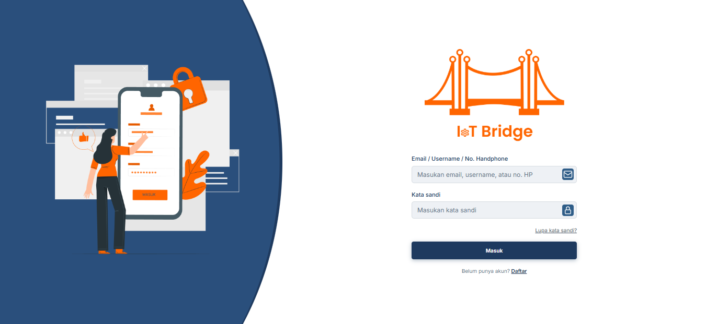

---

### 2. ✅ PASS — Halaman registrasi dapat diakses dan form tersedia

**Catatan:** Form registrasi ditemukan

**Screenshot:**

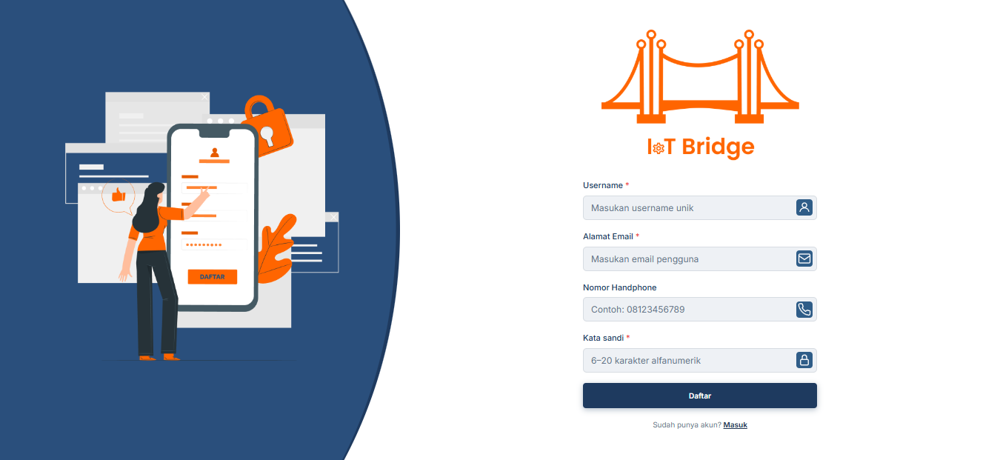

---

### 3. ✅ PASS — Halaman lupa kata sandi dapat diakses

**Catatan:** Halaman termuat

**Screenshot:**

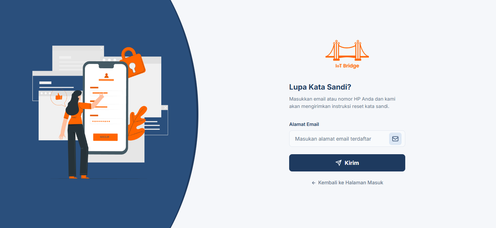

---

### 4. ✅ PASS — Login dengan password salah harus tampilkan error

**Catatan:** Pesan error muncul

**Screenshot:**

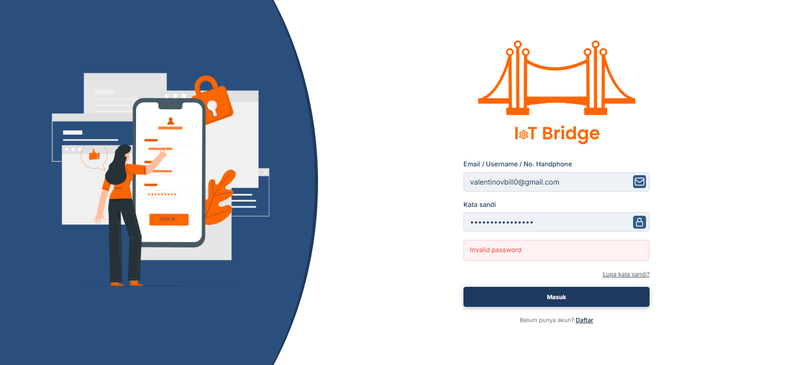

---

### 5. ✅ PASS — Login berhasil lalu redirect ke Dashboard

**Catatan:** URL berisi /dashboard

**Screenshot:**

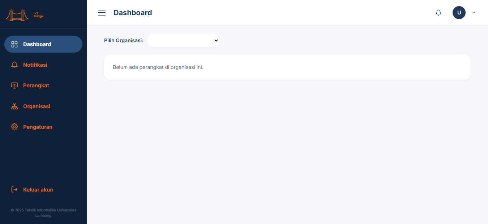

---

### 6. ✅ PASS — Halaman Dashboard termuat dengan benar

**Catatan:** Dashboard berhasil dimuat

**Screenshot:**

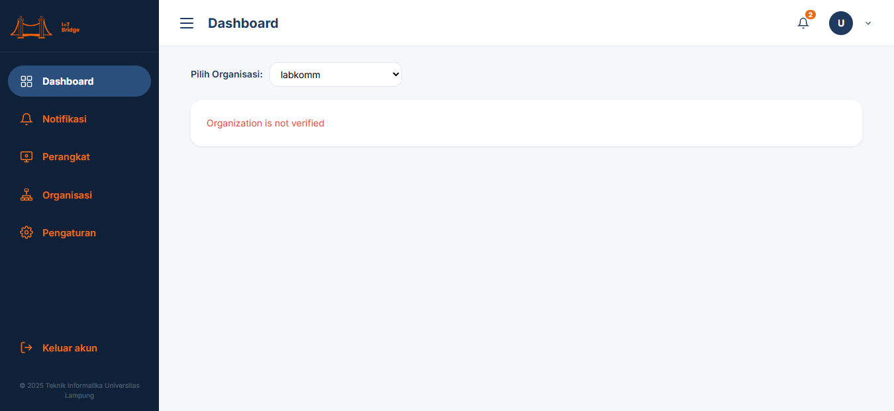

---

### 7. ✅ PASS — Halaman Perangkat termuat dan menampilkan daftar

**Catatan:** Konten perangkat ditemukan

**Screenshot:**

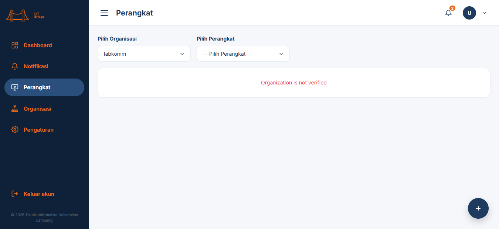

---

### 8. ✅ PASS — Halaman Statistika termuat dengan form filter

**Catatan:** Form filter ditemukan

**Screenshot:**

---

### 9. ✅ PASS — Tombol "Tampilkan Report" disabled saat form belum lengkap

**Catatan:** Tombol disabled

**Screenshot:**

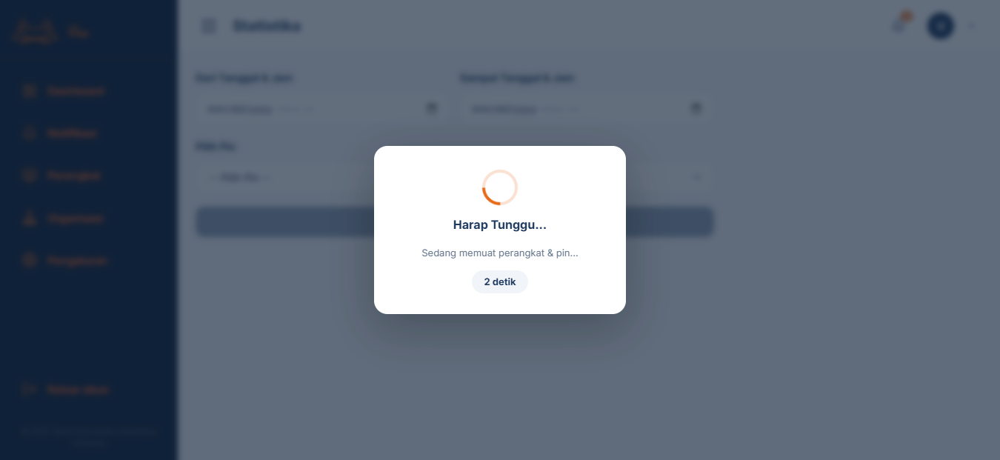

---

### 10. ❌ FAIL — Popup loading muncul saat request report sedang berlangsung

**Catatan:** Form belum lengkap / pin tidak tersedia

**Screenshot:**

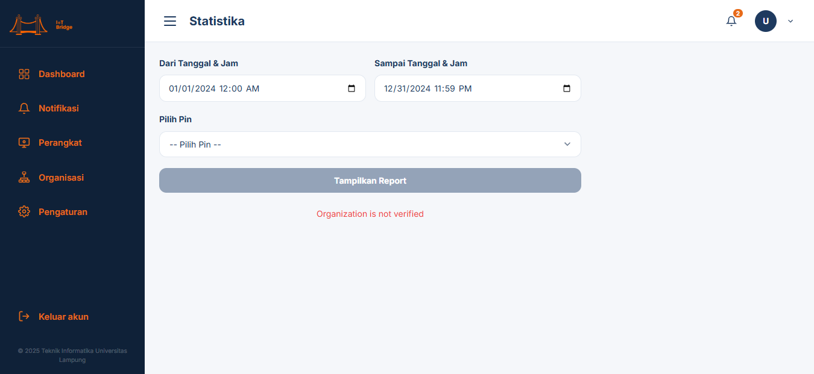

---

### 11. ✅ PASS — Halaman Notifikasi termuat

**Catatan:** Halaman notifikasi berhasil dimuat

**Screenshot:**

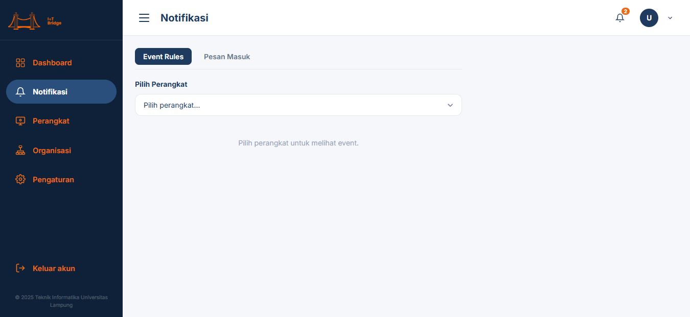

---

### 12. ✅ PASS — Halaman Organisasi termuat

**Catatan:** Daftar organisasi dimuat

**Screenshot:**

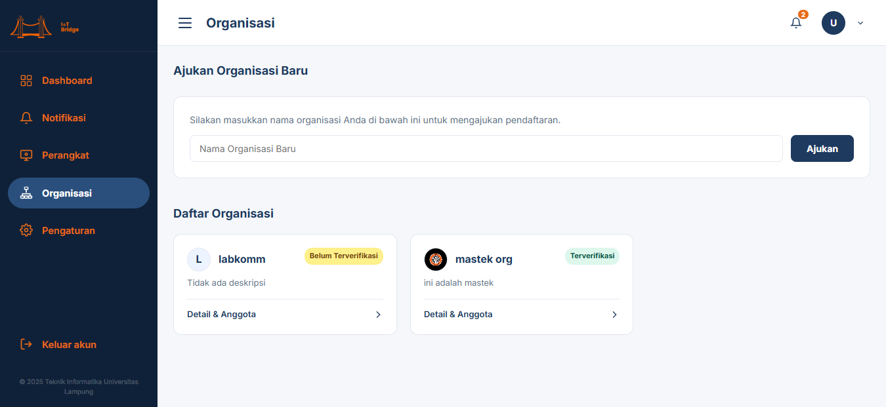

---

### 13. ✅ PASS — Halaman Pengguna termuat

**Catatan:** Halaman pengguna berhasil dimuat

**Screenshot:**

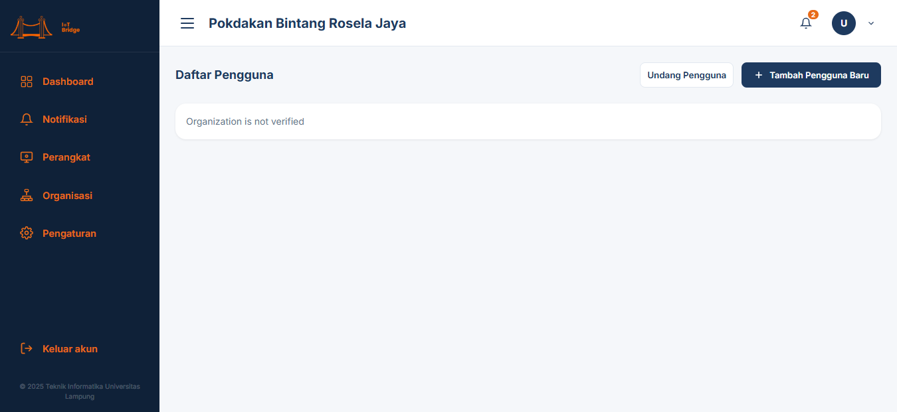

---

### 14. ✅ PASS — Halaman Profil termuat dan menampilkan data user

**Catatan:** Data profil ditemukan

**Screenshot:**

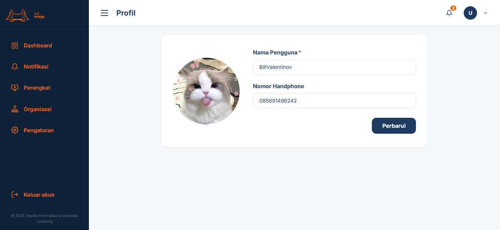

---

### 15. ✅ PASS — Halaman Pengaturan termuat

**Catatan:** Halaman pengaturan berhasil dimuat

**Screenshot:**

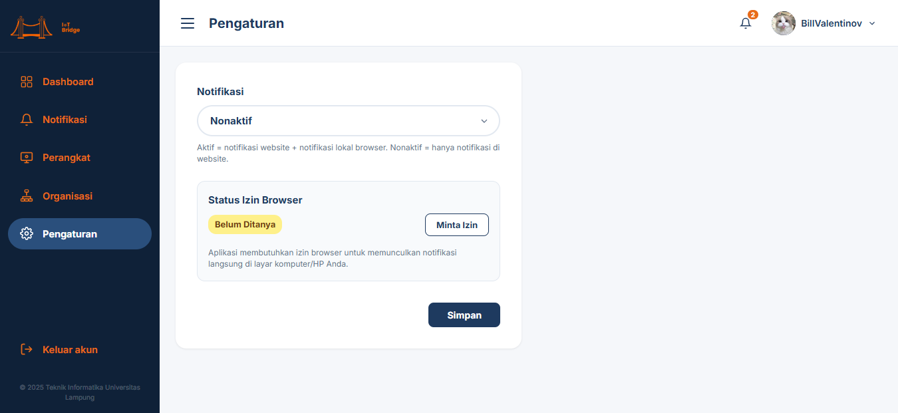

---

### 16. ✅ PASS — Halaman Ubah Email termuat dengan form

**Catatan:** Form email ditemukan

**Screenshot:**

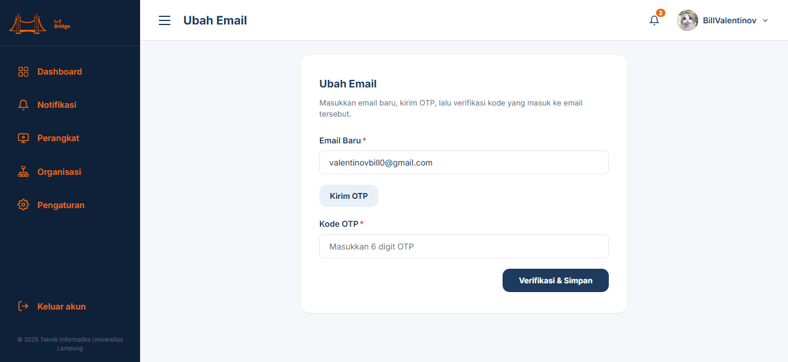

---

### 17. ✅ PASS — Halaman Ubah Kata Sandi termuat dengan form

**Catatan:** Form password ditemukan

**Screenshot:**

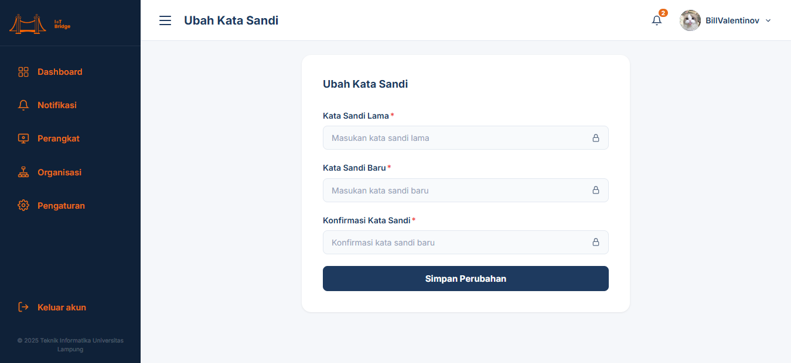

---

### 18. ✅ PASS — Navigasi sidebar berfungsi (Dashboard → Perangkat)

**Catatan:** Berhasil navigasi via sidebar

**Screenshot:**

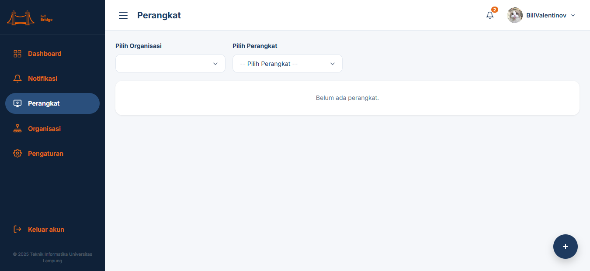

---

### 19. ❌ FAIL — Rute tidak dikenal ditangani dengan baik

**Catatan:** URL tak terduga: http://localhost:5173/halaman-tidak-ada-xyz

**Screenshot:**

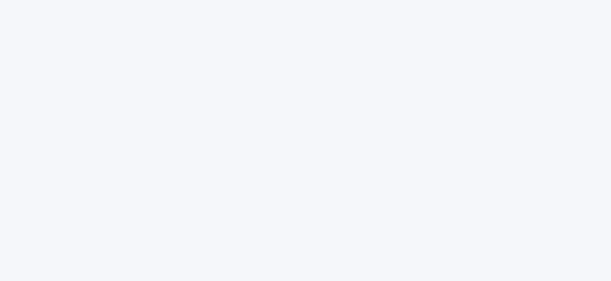

---

## 📝 Daftar Skenario yang Diuji

| Kategori | Skenario |
|---|---|
| Autentikasi | Login gagal (password salah) |
| Autentikasi | Login berhasil & redirect ke Dashboard |
| Autentikasi | Guard: akses tanpa login di-redirect ke /masuk |
| Autentikasi | Halaman Registrasi tersedia |
| Autentikasi | Halaman Lupa Kata Sandi tersedia |
| Dashboard | Halaman Dashboard termuat |
| Perangkat | Halaman Perangkat termuat |
| Statistika | Halaman Statistika termuat |
| Statistika | Tombol disabled saat form kosong |
| Statistika | Loading popup saat request |
| Notifikasi | Halaman Notifikasi termuat |
| Organisasi | Halaman Organisasi termuat |
| Pengguna | Halaman Pengguna termuat |
| Akun | Halaman Profil termuat |
| Akun | Halaman Pengaturan termuat |
| Akun | Halaman Ubah Email termuat |
| Akun | Halaman Ubah Kata Sandi termuat |
| Navigasi | Sidebar link berfungsi |
| Routing | Rute tidak dikenal ditangani |

> Screenshot tersimpan di folder `tests/screenshots/`
